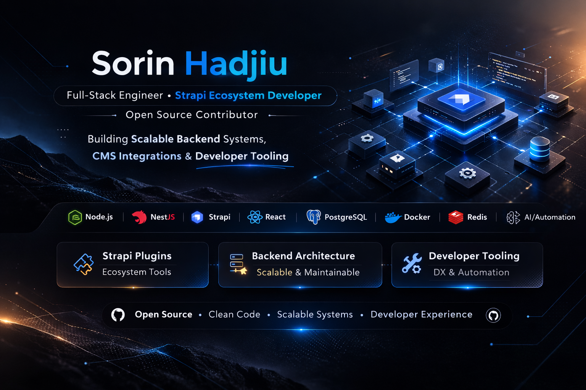

  

<h1 align="center">Hi 👋, I'm Sorin Hadjiu</h1>

<strong>Full-Stack Engineer • Strapi Ecosystem Developer • Open Source Contributor</strong>

Designing scalable CMS platforms, APIs and developer tooling.

---

## ⚡ Focus Areas

• Strapi ecosystem plugins and CMS tooling  
• API-driven backend systems (Node.js / NestJS)  
• Modern frontend platforms (React / Next.js / Astro / Svelte)  
• Automation and AI integrations  
• Developer tooling and platform architecture  

---

## 🚀 About Me

I’m a **full-stack engineer with 8+ years of experience** building scalable platforms, CMS systems and developer tools.

My work focuses on:

• backend architecture with **Node.js / NestJS**  
• **Strapi CMS ecosystem** and plugin development  
• modern frontends with **React, Next.js, Astro and Svelte**  
• **AI integrations and automation systems**  
• developer tooling and platform workflows  

> I enjoy building tools that simplify complex systems and improve developer experience.

---

## 🧩 Systems I Build

I enjoy designing **complete application systems**, not just isolated components.

Typical architecture I work with:

• **Headless CMS platforms** (Strapi + custom plugins)  
• **API-driven backends** (Node.js / NestJS)  
• **Modern frontend applications** (React / Next.js / Astro / Svelte)  
• **Automation and AI integrations**  
• **Developer tooling and platform extensions**

My goal is to build systems that are **scalable, maintainable and developer-friendly**.

---

## 🟦 Strapi Ecosystem

I actively build tools and integrations for the **Strapi CMS ecosystem**, improving developer experience and editor workflows.

My work includes:

• custom Strapi plugins  
• admin panel extensions  
• CMS integrations  
• developer tooling for Strapi platforms  

---

## ⭐ Featured Open Source Work

### Strapi × Lucide Integration

I created **strapi-lucide-icons**, a plugin connecting the **Strapi CMS ecosystem** with the **Lucide icon library**.

This allows developers and editors to browse and select Lucide icons directly inside the Strapi admin panel.

Repository  
https://github.com/shx08/strapi-lucide-icon

---

## 🏗 Projects

I have contributed to building platforms and applications such as:

**Fineguide AI**  
https://fineguide.ai  

AI-powered conversational platform and automation tools.

**BoundaryCare**  
https://boundarycare.com  

Healthcare platform focused on patient engagement and care management.

**Villa Maria Perivoli**  
https://villamariaperivoli.com  

Modern website and digital presence for a luxury villa in Corfu.

---

## 🛠 Tech Stack

---

## 📈 GitHub Stats

---

## 🚧 Currently Building

• Strapi ecosystem plugins  
• developer tooling for CMS platforms  
• AI-powered backend systems  

---

## 🤝 Connect

GitHub  
https://github.com/shx08  

LinkedIn  
https://www.linkedin.com/in/sorinhadjiu/  

NPM  
https://www.npmjs.com/~jonathan_clay  

Gravatar  
https://gravatar.com/shx08  

---

<!--
strapi developer
strapi plugin developer
strapi cms developer
nodejs backend developer
nestjs developer
react developer
nextjs developer
astro developer
svelte developer
headless cms developer
cms plugin developer
developer tooling
strapi ecosystem developer
-->
